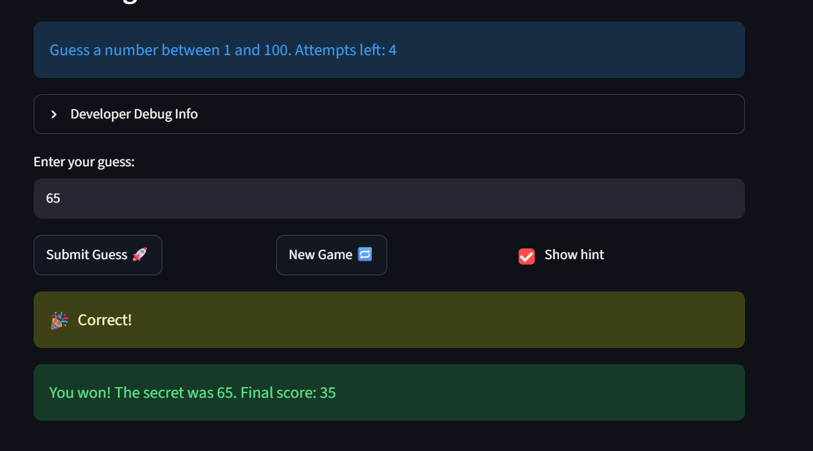

# 🎮 Game Glitch Investigator: The Impossible Guesser

## 🚨 The Situation

You asked an AI to build a simple "Number Guessing Game" using Streamlit.
It wrote the code, ran away, and now the game is unplayable. 

- You can't win.
- The hints lie to you.
- The secret number seems to have commitment issues.

## 🛠️ Setup

1. Install dependencies: `pip install -r requirements.txt`
2. Run the broken app: `python -m streamlit run app.py`

## 🕵️‍♂️ Your Mission

1. **Play the game.** Open the "Developer Debug Info" tab in the app to see the secret number. Try to win.
2. **Find the State Bug.** Why does the secret number change every time you click "Submit"? Ask ChatGPT: *"How do I keep a variable from resetting in Streamlit when I click a button?"*
3. **Fix the Logic.** The hints ("Higher/Lower") are wrong. Fix them.
4. **Refactor & Test.** - Move the logic into `logic_utils.py`.
   - Run `pytest` in your terminal.
   - Keep fixing until all tests pass!

## 📝 Document Your Experience

- [ ] Describe the game's purpose.
- [ ] Detail which bugs you found.
- [ ] Explain what fixes you applied.

## 📸 Demo Walkthrough

Describe your fixed game in numbered steps so a reader can follow along without watching a video:

1. User enters a guess of 50 
2. The Hint shows to guess higher so user guesses 70
3. The Hint shows to guess lower so user guesses 60
4. The Hint shows to guess higher so user guesses 65
5. The user guessed correctly 
6. The user presses new game
7. The user enters 50 again
8. The user gets the hint to go lower, so user guesses 25
9. The user gets the hint to go higher so the user guesses 40
10. The user gets the hint to go lower, the user guesses 35
11. The user gets the hint to go lower, the user guesses 30
12. The user gets the hint to go lower, the user guesses 27
13. The user gets it correct with 2 attempts left

**Screenshot** *(optional)*: 


## 🧪 Test Results

```
# Paste your pytest output here, e.g.:
# pytest tests/
#============================== test session starts ===============================
platform win32 -- Python 3.13.2, pytest-9.0.3, pluggy-1.6.0 -- C:\Users\hibat\AppData\Local\Programs\Python\Python313\python.exe
cachedir: .pytest_cache
rootdir: C:\Users\hibat\Documents\Projects\AI_110\Week 2\ai110-module1show-gameglitchinvestigator-starter
plugins: anyio-4.9.0
collected 19 items                                                                

tests/test_game_logic.py::test_winning_guess PASSED                         [  5%]
tests/test_game_logic.py::test_guess_too_high PASSED                        [ 10%]
tests/test_game_logic.py::test_guess_too_low PASSED                         [ 15%]
tests/test_game_logic.py::test_check_guess_outcomes[50-50-expected0] PASSED [ 21%]
tests/test_game_logic.py::test_check_guess_outcomes[51-50-expected1] PASSED [ 26%]
tests/test_game_logic.py::test_check_guess_outcomes[49-50-expected2] PASSED [ 31%]
tests/test_game_logic.py::test_check_guess_outcomes[100-1-expected3] PASSED [ 36%]
tests/test_game_logic.py::test_check_guess_outcomes[1-100-expected4] PASSED [ 42%]
tests/test_game_logic.py::test_parse_guess[42-expected0] PASSED             [ 47%]
tests/test_game_logic.py::test_parse_guess[3.9-expected1] PASSED            [ 52%]
tests/test_game_logic.py::test_parse_guess[-7-expected2] PASSED             [ 57%]
tests/test_game_logic.py::test_parse_guess[-2.8-expected3] PASSED           [ 63%]
tests/test_game_logic.py::test_parse_guess[-expected4] PASSED               [ 68%]
tests/test_game_logic.py::test_parse_guess[None-expected5] PASSED           [ 73%]
tests/test_game_logic.py::test_parse_guess[abc-expected6] PASSED            [ 78%]
tests/test_game_logic.py::test_get_range_for_difficulty[Easy-expected0] PASSED [ 84%]
tests/test_game_logic.py::test_get_range_for_difficulty[Normal-expected1] PASSED [89%]
tests/test_game_logic.py::test_get_range_for_difficulty[Hard-expected2] PASSED [ 94%]
tests/test_game_logic.py::test_get_range_for_difficulty[Unknown-expected3] PASSED [100%]

=============================== 19 passed in 0.05s ===============================
```

## 🚀 Stretch Features

- [ ] [If you choose to complete Challenge 4, describe the Enhanced UI changes here — a screenshot is optional]
